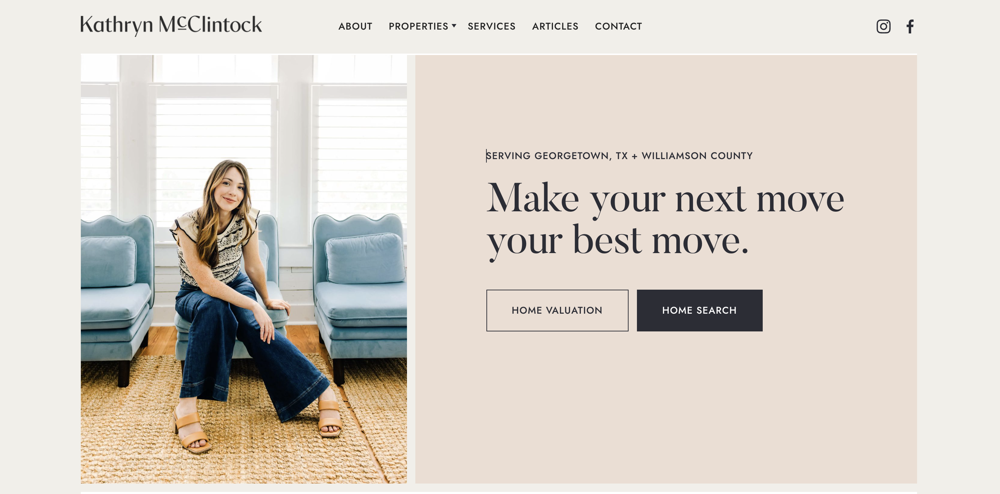
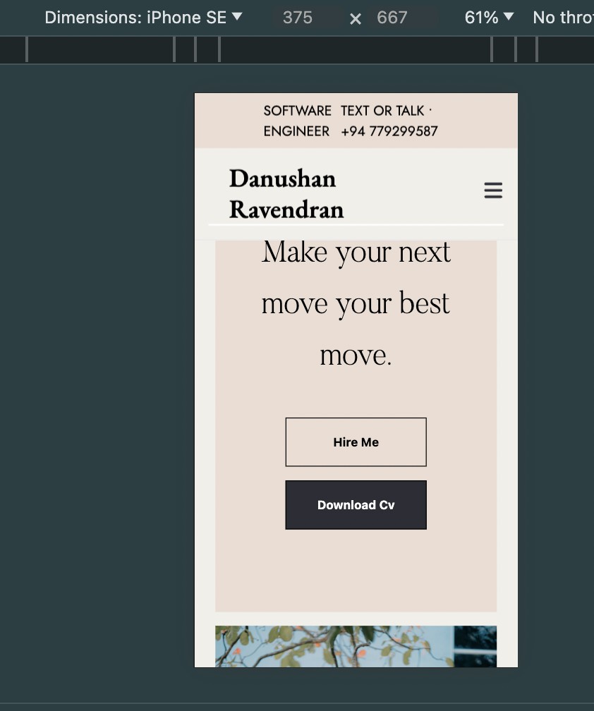
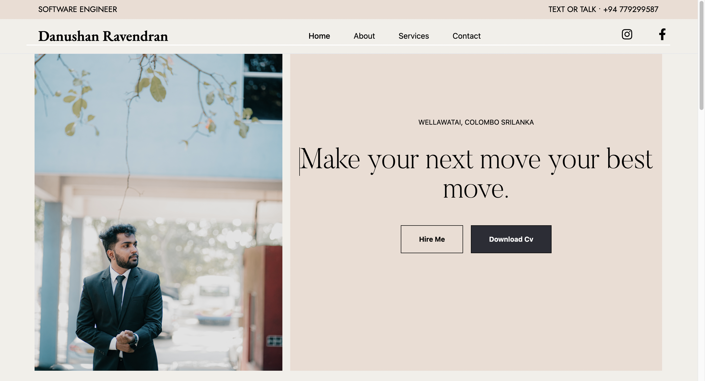

# React + Vite

This template provides a minimal setup to get React working in Vite with HMR and some ESLint rules.

Currently, two official plugins are available:

- [@vitejs/plugin-react](https://github.com/vitejs/vite-plugin-react/blob/main/packages/plugin-react/README.md) uses [Babel](https://babeljs.io/) for Fast Refresh
- [@vitejs/plugin-react-swc](https://github.com/vitejs/vite-plugin-react-swc) uses [SWC](https://swc.rs/) for Fast Refresh

## Task Details 

Design Selection:

I selected a Portfolio Website Design from Dribbble, opting for a minimalist design and a well-curated color theme. Below, you'll find a sample image showcasing the chosen UI design. This selection aims to create a sleek and professional aesthetic for the portfolio website.

Implementation:

This project was built using React.js and Vite.js, leveraging CSS and Tailwind CSS for crafting stunning designs. It focuses on creating a visually appealing and responsive hero section, ensuring an optimal viewing experience across various devices, including desktop and mobile.

Features:
Utilized React.js and Vite.js for efficient development.
Implemented CSS and Tailwind CSS for creating captivating designs.
Ensured the hero section's responsiveness for seamless viewing on both desktop and mobile devices.
Included Assets:
Attached all relevant images and resources for web and mobile views.

### mobile view 

### web view

## published details
This project is hosted on Netlify's free tier. A pipeline has been set up to automate the deployment process: whenever changes are pushed to the master branch on GitHub, Netlify automatically builds and publishes the project.

Deployment Process:
Hosted on Netlify's free tier for seamless deployment.
Automatic pipeline configured to trigger deployment on each push to the master branch on GitHub.

Url - https://dhanudev.netlify.app/
## Run

1.Clone the Project  
2.Navigate into the project directory  
3.Install project dependencies using npm or Yarn.  
4.Once the dependencies are installed, you can start the development server. Use the following command:  

[npm run dev]  
5.Your React + Vite.js project should now be running locally. You can access it in your web browser at the specified address, usually http://localhost:3000.